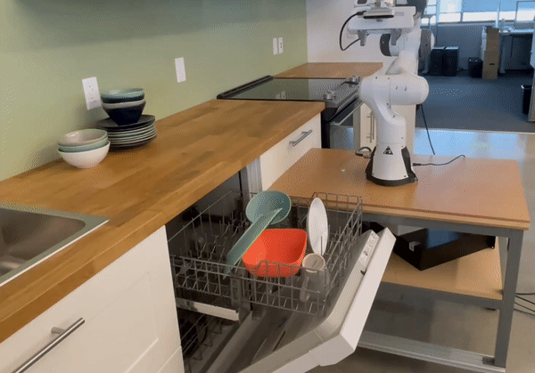
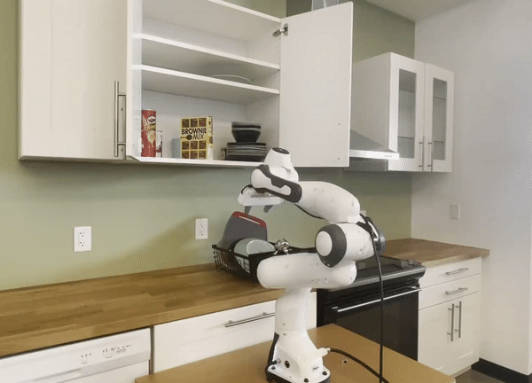
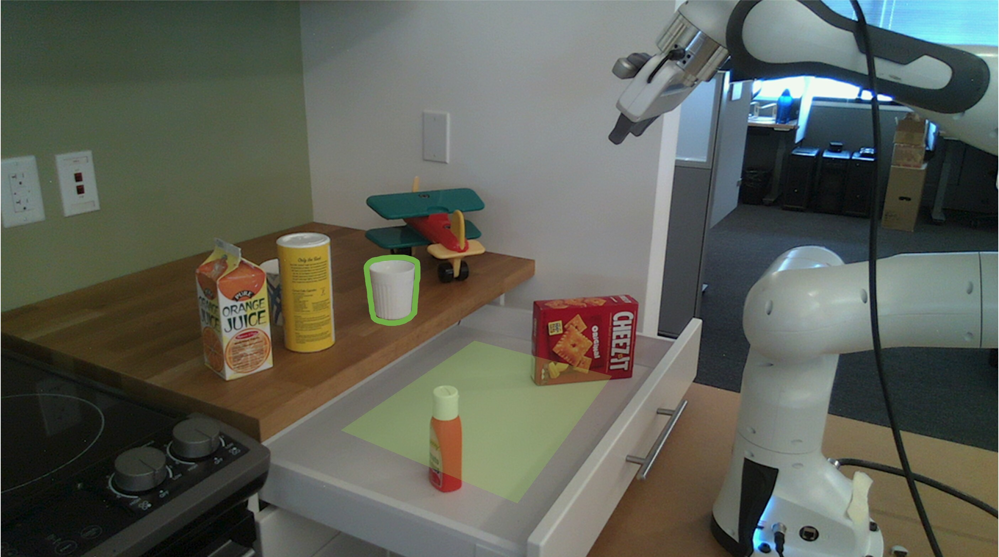
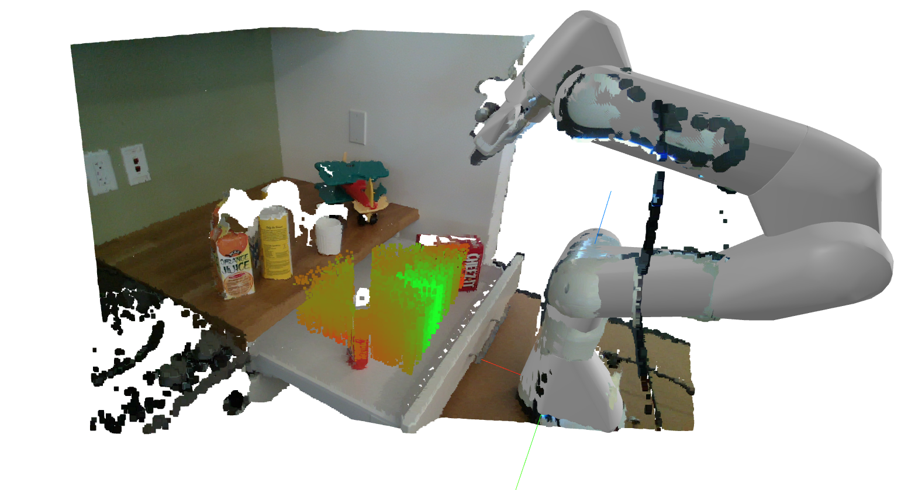
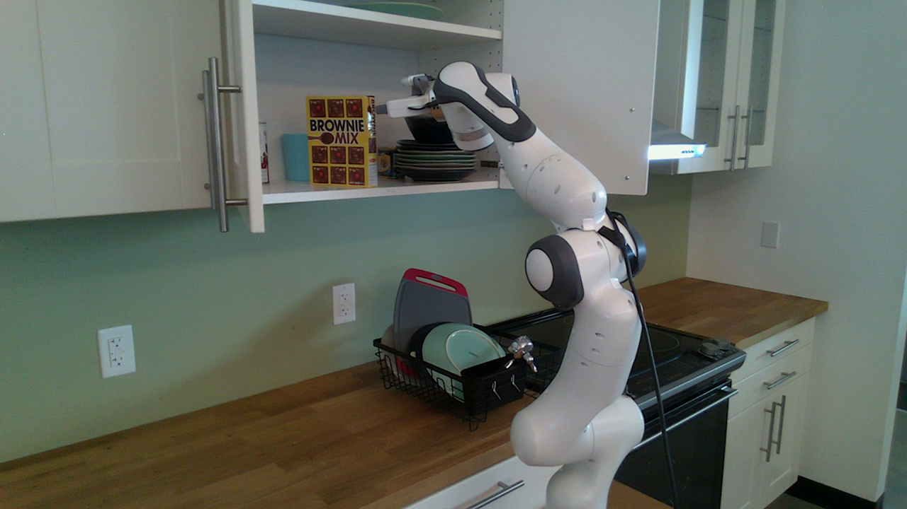
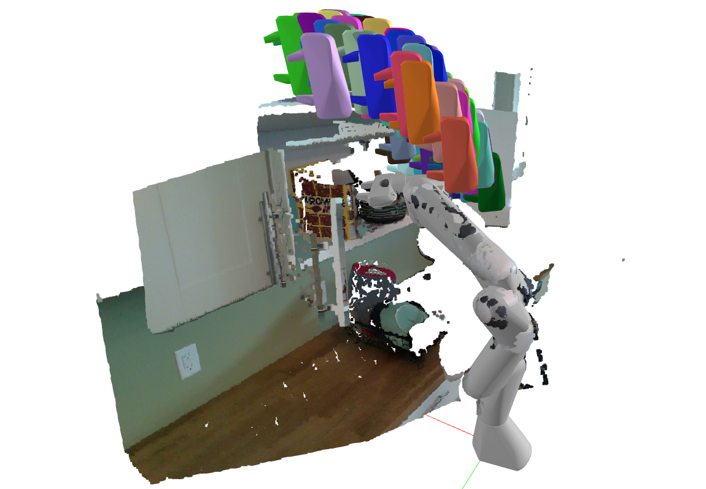

# CabiNet: Scaling Object Rearrangement in Clutter
[CabiNet](https://cabinet-object-rearrangement.github.io/) is collision model for general-purpose object rearrangement, trained with procedurally generated large-scale synthetic data.

[:computer: project page](https://cabinet-object-rearrangement.github.io/) . [:scroll: arXiv](https://arxiv.org/abs/2304.09302) . [:link: checkpoints](https://drive.google.com/file/d/1A6cCv3tpQUXZV9kSCrNNT_VuSLhVg8q0/view?usp=sharing) . [:tv: Video](https://www.youtube.com/watch?v=Bs5QYkJVcjM)

   

## Installation in a Conda environment
```shell
# Install main repo
git clone https://github.com/NVlabs/cabi_net.git
cd cabi_net && conda env create -f conda/environment.yaml
conda activate cabi_net
pip install -e .

# Install PointNet dependency
cd pointnet2 && pip install -e . 
```

### Download pretrained checkpoint
The checkpoint weights can be downloaded from [here](https://drive.google.com/file/d/1A6cCv3tpQUXZV9kSCrNNT_VuSLhVg8q0/view?usp=sharing). Please unzip to the `cabi_net/checkpoints/` folder.

## Example 1: Collision-free placement of Unknown Objects

Here we give a simple demo of using CabiNet for placing objects (just from their point cloud) on support surfaces in a real, unknown kitchen environment. Note that kitchen scenes were not used in training the CabiNet model, and is hence out-of-distribution. In the example script below, all the sampled placement poses are visualized without thresholding. To visualize only the collision-free poses, you can set a higher value (e.g. `0.5`) using the `--threshold` argument. This example uses `meshcat` for 3D visualization - you can run `meshcat-server` in a separate terminal and navigate to the corresponding browser display.

```shell
python examples/demo_placement.py --data-file assets/data/placing_scene_0.npy --model-path checkpoints/cabinet_collision --threshold -1
```
You should see a similar output in the meshcat visualizer.

  

The image on the left shows the task descripton. The segmentation mask of the target object to grasp is given by a separate instance segmentation algorithm. The mask of the placement region (shown in green) is specified by the user. On the image on the right, the colored point cloud of the scene and the robot is visualized. Several potential placement poses are sampled within the placement mask in a bounded height and their positions are displayed. These positions are ranked by their `CabiNet` collision scores (<span style="color:red;">red</span> for being in collision and <span style="color:green;">green</span> for being collision-free).

``NOTE``: To use the `CabiNet` model in any new environment, you will need to specify the `robot_to_model` transform, which is the model's `SE(3)` pose with respect to the robot. The `CabiNet` model was trained by randomizing over various poses, so it will generalize to different model poses. The model was not trained with Franka-specific data, hence it could potentially generalize to other robot geometries as well.

## Example 2: Predicting collision-free waypoints with model after picking object

The [CabiNet](https://cabinet-object-rearrangement.github.io/) model's scene encoding, can also be used as a generative model in sampling waypoints for transitioning between pick and place actions. This is useful when using local controllers like sampling-based Model-Predictive-Control (MPC) in our case. It is crucial in navigating the tight spaces in cluttered scenes such as shelves/kitchens. The waypoint sampler is trained with the scene SDF (more details can be found in [the paper](https://arxiv.org/abs/2304.09302)).

  

```shell
python examples/demo_waypoint.py --data-file assets/data/transitioning_scene_0.npy
```
You should see similar output in the meshcat visualizer. The waypoint samples are visualized in different colors (only the end-effector gripper mesh is plotted). Some of these waypoints have to be further filtered out with a inverse kinematics solver and [CabiNet](https://cabinet-object-rearrangement.github.io/) collision model before executing on the robot.

## Features in the future
This repository only contains the scripts for running inference on the model. In the near future, we will release infrastructure for training and procedural scene data generation as well.

## License
License Copyright © 2023, NVIDIA Corporation & affiliates. All rights reserved.

This code is released under the [NVIDIA source code license](LICENSE). The [pretrained CabiNet model](https://drive.google.com/file/d/1A6cCv3tpQUXZV9kSCrNNT_VuSLhVg8q0/view?usp=sharing) is released under the CC-BY-NC-SA-4.0 license.

## Citation
If you find this work useful in your research, please cite:

	@inproceedings{murali2023cabinet,
	  title={CabiNet: Scaling Neural Collision Detection for Object Rearrangement with Procedural Scene Generation},
	  author={Murali, Adithyavairavan and Mousavian, Arsalan and Eppner, Clemens and Fishman, Adam and Fox, Dieter},
    booktitle = {International Conference on Robotics and Automation},
	  year={2023}
	}
